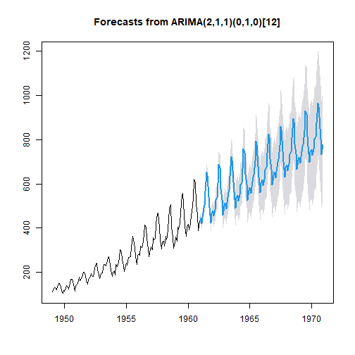

The Purchase Sales Brain Shiny App: To predict the Airline tickets' sales from 1961 to 1970  
========================================================
Author: Darwin Reynell Nava
Date: June, 1st 2022

========================================================

Introduction  
The Purchase & Sales Brain is a Shiny App designed to predict the Airline tickets' sales from 1961 to 1970 using an ARIMA model with the time series available in R datasets called AirPassengers. The classic Box & Jenkins airline data. Its format is a  monthly time series, in thousands. It records Monthly Airline Passenger Numbers from 1949 to 1960. The app is made up of three sections. the first section carries out a forecast for the range of years that the user provides through a slider, the second one presents the ARIMA model validation and the respective pvalues. Finally, the third presents an exploratory analysis of the Airpassangers time series. Graphics are presented in each section, the user can choose specific customizations.The Shiny application and a presentation were hosted on:  
- [Shiny App:Purchase & Sales Brain   ](“https://darwinnava.shinyapps.io/PurchaseSalesBrain/”)
- [Shiny App Presentation](https://rpubs.com/darwinnava/PurchaseSalesBrain)  

========================================================
Dataset  
The classic Box & Jenkins airline data.  

```r
start(AirPassengers)
```

```
[1] 1949    1
```

```r
end(AirPassengers)
```

```
[1] 1960   12
```

```r
frequency(AirPassengers)
```

```
[1] 12
```

========================================================
ARIMA Model and Validation 

```
Series: AirPassengers 
ARIMA(2,1,1)(0,1,0)[12] 

Coefficients:
         ar1     ar2      ma1
      0.5960  0.2143  -0.9819
s.e.  0.0888  0.0880   0.0292

sigma^2 = 132.3:  log likelihood = -504.92
AIC=1017.85   AICc=1018.17   BIC=1029.35

Training set error measures:
                   ME     RMSE      MAE       MPE     MAPE     MASE
Training set 1.342306 10.84619 7.867539 0.4206996 2.800458 0.245628
                     ACF1
Training set -0.001248451
```

========================================================

```
$p.value
[1] 0.711635
```
Forecast  
Predicted values  from 1961 to 1970.  

