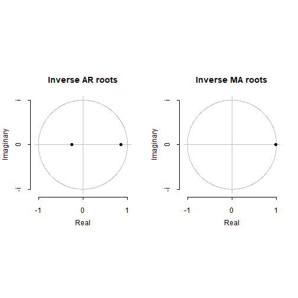

The Purchase Sales Brain Shiny App: To predict the Airline tickets' sales from 1961 to 1970
========================================================
author: Darwin Reynell Nava
date: June, 1st 2022
autosize: true

Introduction
========================================================

The Purchase & Sales Brain is a Shiny App designed to predict the Airline tickets' sales from 1961 to 1970 using an ARIMA model with the time series available in R datasets called AirPassengers. The classic Box & Jenkins airline data. Its format is a  monthly time series, in thousands. It records Monthly Airline Passenger Numbers from 1949 to 1960. 

The app is made up of three sections. the first section carries out a forecast for the range of years that the user provides through a slider, the second one presents the ARIMA model validation and the respective pvalues. Finally, the third presents an exploratory analysis of the Airpassangers time series. Graphics are presented in each section, the user can choose specific customizations.

The Shiny application and a presentation were hosted on: 
- [Shiny App:Purchase & Sales Brain ](“https://gabrielacantos.shinyapps.io/PurchaseSalesBrain/”)
- [Shiny App Presentation](https://github.com/darwinnava/-Purchase-Sales-Brain/tree/main/PurchaseSalesBrain2.Rpres)

Dataset
========================================================
The classic Box & Jenkins airline data.

```r
AirPassengers
```

```
     Jan Feb Mar Apr May Jun Jul Aug Sep Oct Nov Dec
1949 112 118 132 129 121 135 148 148 136 119 104 118
1950 115 126 141 135 125 149 170 170 158 133 114 140
1951 145 150 178 163 172 178 199 199 184 162 146 166
1952 171 180 193 181 183 218 230 242 209 191 172 194
1953 196 196 236 235 229 243 264 272 237 211 180 201
1954 204 188 235 227 234 264 302 293 259 229 203 229
1955 242 233 267 269 270 315 364 347 312 274 237 278
1956 284 277 317 313 318 374 413 405 355 306 271 306
1957 315 301 356 348 355 422 465 467 404 347 305 336
1958 340 318 362 348 363 435 491 505 404 359 310 337
1959 360 342 406 396 420 472 548 559 463 407 362 405
1960 417 391 419 461 472 535 622 606 508 461 390 432
```

ARIMA Model and Validation
========================================================

```
Series: AirPassengers 
ARIMA(2,1,1)(0,1,0)[12] 

Coefficients:
         ar1     ar2      ma1
      0.5960  0.2143  -0.9819
s.e.  0.0888  0.0880   0.0292

sigma^2 = 132.3:  log likelihood = -504.92
AIC=1017.85   AICc=1018.17   BIC=1029.35
```

```

	Box-Ljung test

data:  mymodel$residuals
X-squared = 2.9244, df = 5, p-value = 0.7116
```

```

	Box-Ljung test

data:  mymodel$residuals
X-squared = 8.6878, df = 10, p-value = 0.562
```

Forecast
========================================================
The right graph shows the predicted values in blue for each of the months from 1961 to 1970. On the left, the diagram of the ARIMA model. Finally, a table is presented with the 95 confidence intervals for the year 2021.


```
         Point Forecast    Lo 95     Hi 95
Jan 1961       445.6349 423.0850  468.1847
Feb 1961       420.3950 393.9303  446.8596
Mar 1961       449.1983 419.4892  478.9074
Apr 1961       491.8399 460.0092  523.6706
May 1961       503.3944 469.9953  536.7936
Jun 1961       566.8624 532.3007  601.4242
Jul 1961       654.2601 618.8122  689.7081
Aug 1961       638.5974 602.4629  674.7319
Sep 1961       540.8837 504.2080  577.5593
Oct 1961       494.1266 457.0177  531.2355
Nov 1961       423.3327 385.8715  460.7939
Dec 1961       465.5075 427.7555  503.2595
Jan 1962       479.2908 432.9628  525.6187
Feb 1962       454.1768 404.5359  503.8177
Mar 1962       483.0869 430.5491  535.6247
Apr 1962       525.8192 471.2101  580.4283
May 1962       537.4506 481.2243  593.6769
Jun 1962       600.9838 543.4927  658.4750
Jul 1962       688.4369 629.9331  746.9408
Aug 1962       672.8212 613.4939  732.1485
Sep 1962       575.1474 515.1393  635.1555
Oct 1962       528.4241 467.8443  589.0038
Nov 1962       457.6589 396.5918  518.7259
Dec 1962       499.8581 438.3695  561.3466
Jan 1963       513.6620 445.5403  581.7837
Feb 1963       488.5655 417.4973  559.6337
Mar 1963       517.4905 443.7727  591.2084
Apr 1963       560.2354 484.5273  635.9436
May 1963       571.8776 494.5572  649.1980
Jun 1963       635.4199 556.7905  714.0493
Jul 1963       722.8807 643.1656  802.5958
Aug 1963       707.2716 626.6425  787.9006
Sep 1963       609.6032 528.1927  691.0138
Oct 1963       562.8846 480.7960  644.9733
Nov 1963       492.1234 409.4381  574.8087
Dec 1963       534.3260 451.1089  617.5432
Jan 1964       548.1329 459.1422  637.1235
Feb 1964       523.0388 431.2594  614.8183
Mar 1964       551.9659 457.6372  646.2946
Apr 1964       594.7126 498.4026  691.0225
May 1964       606.3562 508.3986  704.3138
Jun 1964       669.8998 570.5677  769.2319
Jul 1964       757.3617 656.8601  857.8632
Aug 1964       741.7534 640.2428  843.2641
Sep 1964       644.0859 541.6916  746.4801
Oct 1964       597.3679 494.1896  700.5463
Nov 1964       526.6073 422.7243  630.4903
Dec 1964       568.8104 464.2866  673.3341
Jan 1965       582.6176 472.7939  692.4413
Feb 1965       557.5239 444.9741  670.0737
Mar 1965       586.4513 471.3816  701.5209
Apr 1965       629.1982 512.1188  746.2775
May 1965       640.8420 522.0575  759.6265
Jun 1965       704.3858 584.1493  824.6222
Jul 1965       791.8478 670.3521  913.3436
Aug 1965       776.2397 653.6371  898.8423
Sep 1965       678.5722 554.9836  802.1609
Oct 1965       631.8544 507.3763  756.3325
Nov 1965       561.0938 435.8043  686.3833
Dec 1965       603.2970 477.2594  729.3346
Jan 1966       617.1042 486.0614  748.1471
Feb 1966       592.0106 458.2584  725.7628
Mar 1966       620.9380 484.6609  757.2151
Apr 1966       663.6849 525.3520  802.0179
May 1966       675.3288 535.2236  815.4340
Jun 1966       738.8726 597.2336  880.5116
Jul 1966       826.3347 683.3453  969.3240
Aug 1966       810.7266 666.5333  954.9198
Sep 1966       713.0591 567.7790  858.3392
Oct 1966       666.3413 520.0689  812.6137
Nov 1966       595.5807 448.3928  742.7687
Dec 1966       637.7839 489.7432  785.8246
Jan 1967       651.5912 498.7423  804.4400
Feb 1967       626.4975 470.9320  782.0630
Mar 1967       655.4249 497.3113  813.5386
Apr 1967       698.1719 537.9478  858.3959
May 1967       709.8158 547.7486  871.8829
Jun 1967       773.3596 609.6762  937.0429
Jul 1967       860.8216 695.6980 1025.9452
Aug 1967       845.2135 678.7912 1011.6358
Sep 1967       747.5461 579.9391  915.1530
Oct 1967       700.8283 532.1292  869.5273
Nov 1967       630.0677 460.3523  799.7831
Dec 1967       672.2709 501.6014  842.9403
Jan 1968       686.0781 510.7383  861.4179
Feb 1968       660.9845 482.9070  839.0620
Mar 1968       689.9119 509.2530  870.5708
Apr 1968       732.6588 549.8310  915.4867
May 1968       744.3027 559.5601  929.0454
Jun 1968       807.8465 621.4063  994.2867
Jul 1968       895.3086 707.3404 1083.2767
Aug 1968       879.7005 690.3419 1069.0591
Sep 1968       782.0330 591.3952  972.6709
Oct 1968       735.3152 543.4891  927.1414
Nov 1968       664.5547 471.6148  857.4945
Dec 1968       706.7578 512.7660  900.7497
Jan 1969       720.5651 522.0020  919.1282
Feb 1969       695.4715 494.1413  896.8017
Mar 1969       724.3989 520.4481  928.3497
Apr 1969       767.1458 560.9660  973.3257
May 1969       778.7897 570.6238  986.9556
Jun 1969       842.3335 632.3905 1052.2765
Jul 1969       929.7956 718.2397 1141.3514
Aug 1969       914.1874 701.1524 1127.2225
Sep 1969       816.5200 602.1146 1030.9254
Oct 1969       769.8022 554.1157  985.4887
Nov 1969       699.0416 482.1476  915.9357
Dec 1969       741.2448 523.2044  959.2852
Jan 1970       755.0521 532.5124  977.5917
Feb 1970       729.9584 504.6172  955.2997
Mar 1970       758.8859 530.8813  986.8904
Apr 1970       801.6328 571.3387 1031.9269
May 1970       813.2767 580.9264 1045.6270
Jun 1970       876.8205 642.6158 1111.0252
Jul 1970       964.2825 728.3827 1200.1823
Aug 1970       948.6744 711.2099 1186.1389
Sep 1970       851.0070 612.0842 1089.9298
Oct 1970       804.2892 563.9959 1044.5825
Nov 1970       733.5286 491.9374  975.1198
Dec 1970       775.7318 532.9031 1018.5604
```
